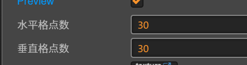

布料和绳子的原理都是弹簧质点模型
绳子是一维的弹簧质点,布料是二维的弹簧质点
所以只以布料举例，绳子同理。

使用方法:
## 添加组件

## 添加图片

把需要用来模拟布料的图片拖到这个位置。
## 调节参数:
- 调节固定点

提供了矩形四个顶点的固定 和 四个边沿固定 的固定方式。
- 调节网格大小 

布料模拟时，会把图片分割成m x n的网格，网格格点之间连接弹簧。
理论上网格越密集，模拟效果越好，但性能越差。
不要设置过多网格，尽量减少网格数提高性能，建议网格数取值在5 - 30之间。
- 调节空气阻力和迭代次数

1表示没有空气阻力，这个值尽量在0.9以上，表示轻微的空气阻力。
迭代次数是每帧进行积分的次数。
之所以要迭代多次，是因为弹簧质点模型本质上是弹簧振子周期震动的原理。
周期震动肯定有周期T。如果一次迭代需要的deltaTime比周期T还大，是算不出正确结果的。
理论上deltaTime应该比T小一个数量级，才能正确的模拟，否则可能产生积分爆炸，即多次迭代后数值没有收敛，而是趋向了无穷大（网格点的位置全部变成无穷大了）
但是布料模拟里掺入了空气阻力，重力，恢复力等多种效果。并不能简单的计算出其周期T。
所以迭代次数需要你手动调节，以保证其收敛。

恢复力，可以理解成木板弯曲后还原的能力。如果还原能力弱就变成了布料。
0表示不还原，1表示不弯曲。
[保持形状系数]以挂起来的窗帘为例，越靠下越柔软，柔软度默认为线性递增，cocos没有曲线编辑其，默认内置了三种函数线性，常量，开方。默认为线性，柔软度线性递增。常量即处处柔软度一致。开方是在线性的基础上又做了开方。
[保持形状最小值]配合[保持形状系数]使用，0或1所有点的[保持形状系一致],0-1之间有线性递增关系
## 添加风力场:

这里解释下风力采样精度，风力场内风力（屏幕内各处的风力方向和大小）是通过柏林噪声计算的。
这个是运行在cpu端的二维柏林噪声（类似噪声图）。如果精度越小，噪声图各处越连续，精度越大，越不连续，即相邻两点间的风力值可能产生突变，就不是飘动而是抖动了。
所以这个值尽量小。也跟你的图片大小和网格数有关，所以暴露出来手动调节。