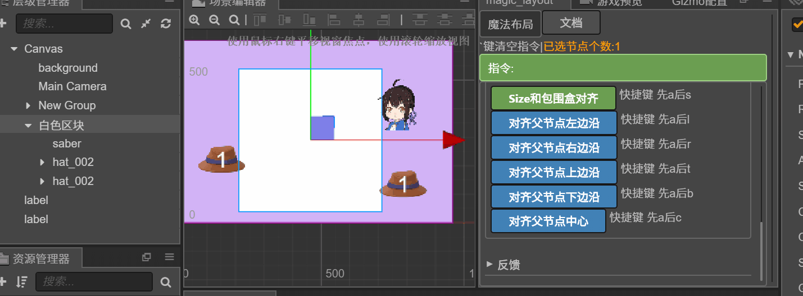

# 批量重命名

可以相对Canvas或者父节点的BoundingBox来对齐

这些布局方式都有快捷键与之对应

- 相对父节点左边沿对齐 快捷键:先按a,然后按l
- 相对父节点右边沿对齐 快捷键:先按a,然后按r
- 相对父节点上边沿对齐 快捷键:先按a,然后按t
- 相对父节点下边沿对齐 快捷键:先按a,然后按b
- 相对父节点中心对齐 快捷键:先按a,然后按c

- 相对Canvas左边沿对齐 快捷键:先按A,然后按l
- 相对Canvas右边沿对齐 快捷键:先按A,然后按r
- 相对Canvas上边沿对齐 快捷键:先按A,然后按t
- 相对Canvas下边沿对齐 快捷键:先按A,然后按b
- 相对Canvas中心对齐 快捷键:先按A,然后按c

Size和包围盒对齐的意思是修改节点的ContentSize和锚点位置让它正好包裹住所有子节点。